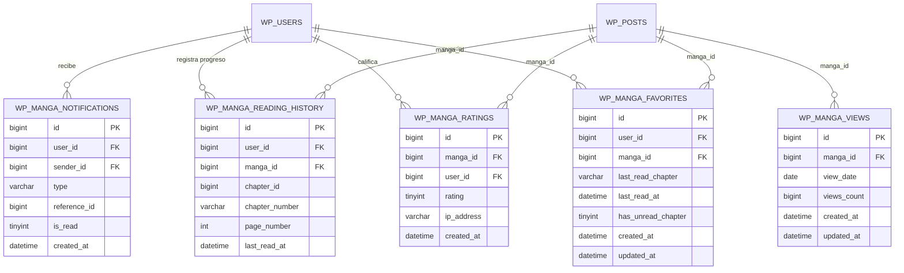

# LectorThema - Estructura y Esquema de Base de Datos MySQL

## 1. Tablas Personalizadas del Sistema

Para garantizar tiempos de respuesta en milisegundos incluso con millones de visitas y decenas de miles de capítulos, el sistema desacopla la analítica de vistas y el seguimiento de favoritos de la tabla `wp_postmeta`, utilizando tablas InnoDB dedicadas con índices compuestos.



---

## 2. Definición Detallada de Tablas

### 2.1 Tabla: `wp_manga_favorites`
Almacena la relación entre usuarios registrados y sus obras guardadas, controlando las alertas de nuevos capítulos no leídos.

| Campo | Tipo | Nulo | Descripción |
| :--- | :--- | :--- | :--- |
| `id` | BIGINT(20) UNSIGNED | NO | Identificador único autoincremental (PK) |
| `user_id` | BIGINT(20) UNSIGNED | NO | ID del usuario en `wp_users` |
| `manga_id` | BIGINT(20) UNSIGNED | NO | ID de la obra en `wp_posts` |
| `last_read_chapter`| VARCHAR(64) | SÍ | Número del último capítulo leído por el usuario |
| `last_read_at` | DATETIME | SÍ | Fecha y hora de la última lectura |
| `has_unread_chapter`| TINYINT(1) | NO | `1` si hay capítulos nuevos sin leer, `0` si está al día |
| `created_at` | DATETIME | NO | Fecha en que se agregó a favoritos |
| `updated_at` | DATETIME | NO | Timestamp de última modificación |

* **Índices**:
  * `PRIMARY KEY (id)`
  * `UNIQUE KEY uk_user_manga (user_id, manga_id)`
  * `KEY idx_user_id (user_id)`
  * `KEY idx_manga_id (manga_id)`
  * `KEY idx_unread_alert (user_id, has_unread_chapter)`

---

### 2.2 Tabla: `wp_manga_views`
Permite calcular los rankings **Diario**, **Semanal**, **Mensual** e **Histórico** con consultas agrupadas extremadamente veloces gracias a su índice compuesto `(view_date, views_count DESC)`.

| Campo | Tipo | Nulo | Descripción |
| :--- | :--- | :--- | :--- |
| `id` | BIGINT(20) UNSIGNED | NO | Identificador único autoincremental (PK) |
| `manga_id` | BIGINT(20) UNSIGNED | NO | ID de la obra en `wp_posts` |
| `view_date` | DATE | NO | Fecha de registro (YYYY-MM-DD) |
| `views_count` | BIGINT(20) UNSIGNED | NO | Conteo acumulado de visitas en esa fecha |
| `created_at` | DATETIME | NO | Creación del registro |
| `updated_at` | DATETIME | NO | Timestamp de actualización |

* **Índices**:
  * `PRIMARY KEY (id)`
  * `UNIQUE KEY uk_manga_date (manga_id, view_date)`
  * `KEY idx_manga_id (manga_id)`
  * `KEY idx_view_date (view_date)`
  * `KEY idx_date_views (view_date, views_count DESC)`

---

### 2.3 Tabla: `wp_manga_notifications`
Gestiona las alertas y notificaciones directas entre miembros de la comunidad (respuestas a comentarios en mangas y capítulos).

| Campo | Tipo | Nulo | Descripción |
| :--- | :--- | :--- | :--- |
| `id` | BIGINT(20) UNSIGNED | NO | Identificador único autoincremental (PK) |
| `user_id` | BIGINT(20) UNSIGNED | NO | ID del usuario destinatario de la notificación |
| `sender_id` | BIGINT(20) UNSIGNED | SÍ | ID del usuario que originó la acción |
| `type` | VARCHAR(32) | NO | Tipo de notificación (`comment_reply`, etc.) |
| `reference_id` | BIGINT(20) UNSIGNED | NO | ID del post / manga / capítulo asociado |
| `is_read` | TINYINT(1) | NO | `0` = No leído, `1` = Leído |
| `created_at` | DATETIME | NO | Fecha y hora en que se originó la notificación |

* **Índices**:
  * `PRIMARY KEY (id)`
  * `KEY idx_user_read (user_id, is_read)`
  * `KEY idx_user_created (user_id, created_at DESC)`

---

## 3. Consultas SQL Optimizadas de Ejemplo

### 3.1 Obtener Top Semanal
```sql
SELECT manga_id, SUM(views_count) as total_views
FROM wp_manga_views
WHERE view_date >= DATE_SUB(CURDATE(), INTERVAL 7 DAY)
GROUP BY manga_id
ORDER BY total_views DESC
LIMIT 10;
```

### 3.2 Alerta al Publicar un Nuevo Capítulo
```sql
-- Actualiza la alerta para todos los usuarios que siguen el manga
UPDATE wp_manga_favorites 
SET has_unread_chapter = 1 
WHERE manga_id = 42;
```
