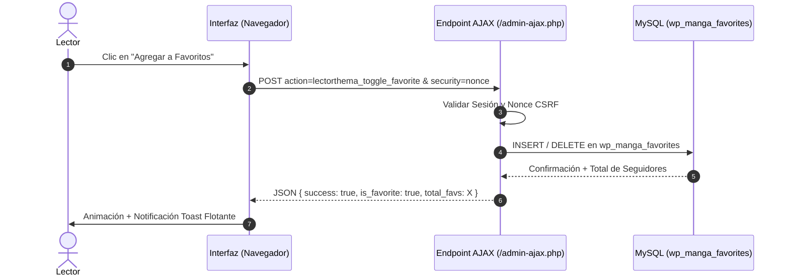
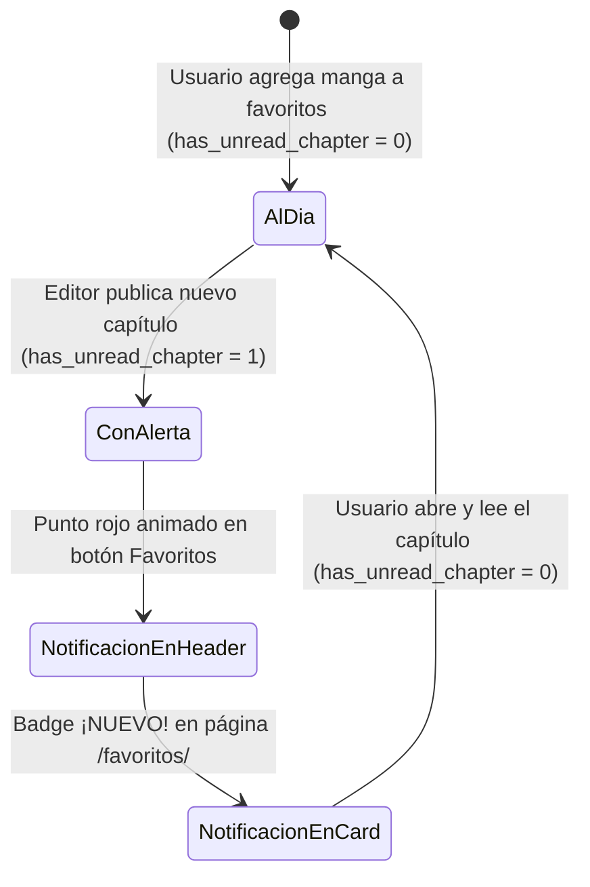

# LectorThema - Sistema de Favoritos y Notificación de Capítulos

## 1. Funcionamiento del Sistema de Favoritos

El sistema de favoritos de **LectorThema** permite a los usuarios registrados mantener una biblioteca personalizada de obras en seguimiento y recibir avisos visuales automáticos cuando se publica un nuevo capítulo.



---

## 2. Ciclo de Vida de las Alertas de Nuevos Capítulos



1. **Suscripción**: Cuando un usuario añade una obra a favoritos, se inserta un registro en `wp_manga_favorites` con `has_unread_chapter = 0`.
2. **Disparador de Publicación (Hook `save_post`)**: Cuando un administrador o editor publica un nuevo capítulo asociado a una obra, el sistema ejecuta:
   ```php
   $wpdb->query($wpdb->prepare(
       "UPDATE {$wpdb->prefix}manga_favorites SET has_unread_chapter = 1 WHERE manga_id = %d",
       $manga_id
   ));
   ```
3. **Indicador Visual**:
   * En la cabecera del sitio aparece un punto rojo palpitante (`.badge-alert-dot`) junto al botón de favoritos.
   * En la página de favoritos (`/favoritos/`), la obra muestra una insignia superior `¡NUEVO!`.
4. **Reseteo al Leer**: Al abrir el capítulo o mediante el endpoint AJAX `lectorthema_mark_read`, la alerta vuelve a `0`.

---

## 3. Requisito de Cuenta y Experiencia de Usuario

Para garantizar la integridad de las bibliotecas y el control de notificaciones:
- **Favoritos**: Si un usuario no autenticado hace clic en "Agregar a Favoritos", el sistema intercepta el clic y despliega automáticamente el modal de autenticación (`#mangaAuthModal`) invitándolo a iniciar sesión o crear su cuenta.
- **Comentarios en Manga y Capítulos**: Los formularios de comentarios están reservados exclusivamente para usuarios registrados; los visitantes ven una tarjeta de llamada a la acción ("Únete a la comunidad de LectorThema") con accesos directos para registrarse o identificarse.

